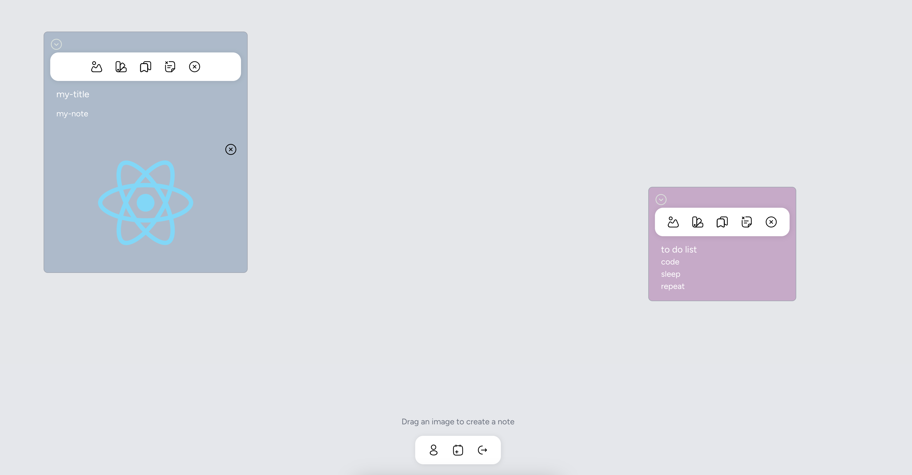

# My-NoteApp

a small application that allows you to have notes on a virtual whiteboard





## Installation

Clone the repo locally:

```sh
git clone https://github.com/SamueleNonino/my-noteapp.git
cd my-noteapp
```

Install PHP dependencies:

```sh
composer install
```

Install NPM dependencies:

```sh
npm install
```

Build assets:

```sh
npm run dev
```

Setup configuration:

```sh
cp .env.example .env
```

Generate application key:

```sh
php artisan key:generate
```

Run database migrations:

```sh
php artisan migrate
```

Run database seeder:

```sh
php artisan db:seed
```

Run artisan server:

```sh
php artisan serve
```

You're ready to go! [my-noteapp](http://127.0.0.1:8000/) in your browser, and login with:
- **Username:** mail@example.com
- **Password:** password